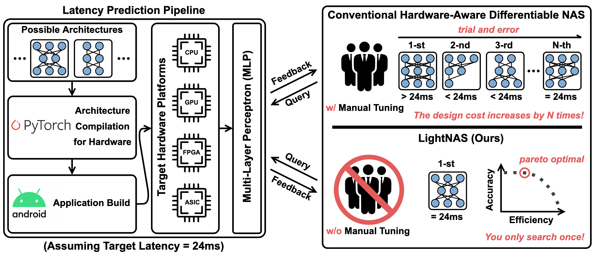

# *You Only Search Once*: On Lightweight Differentiable Architecture Search for Resource-Constrained Embedded Platforms

## Overview
This repository contains the PyTorch implementation of LightNAS, which is able to find the required architecture that strictly satisfies the specified performance constraint like latency and energy through a one-time search (i.e., *you only search once*). 
<center>

</center>

## Environments
* Python - 3.7.10
* Pytorch - 1.7.0 
* CUDA - 11.2
* GPU - GeForce RTX 3090

## Preprocessing
To prepare for the validation dataset of ImageNet, you may simply follow the instructions as below:

1. Download the ImageNet ILSVRC2012 validation dataset (i.e., ILSVRC2012_img_val.tar).

2. Extract ILSVRC2012_img_val.tar to the val directory with
   ```
   mkdir val && tar -xvf ILSVRC2012_img_val.tar -C ./val
   ```

3. Copy preprocess_val_dataset.sh to the val directory and re-organize the validation images with
   ```
   bash preprocess_val_dataset.sh
   ```
   
4. Delete preprocess_val_dataset.sh in the val directory with
   ```
   rm preprocess_val_dataset.sh
   ```

5. Finally, the dataset folder should look like
   ```
   -- dataset
      -- train
      -- val
   ```

## How to Search
You may use the followng commands to search for LightNets on one single GPU:
```
# LightNet-20ms
python3 search_imagenet.py --save search-target-latency-20ms --gpus 1 --visible 0 --target_latency 20 --dataset /path/to/dataset/

# LightNet-22ms
python3 search_imagenet.py --save search-target-latency-22ms --gpus 1 --visible 0 --target_latency 22 --dataset /path/to/dataset/

# LightNet-24ms
python3 search_imagenet.py --save search-target-latency-24ms --gpus 1 --visible 0 --target_latency 24 --dataset /path/to/dataset/

# LightNet-26ms
python3 search_imagenet.py --save search-target-latency-26ms --gpus 1 --visible 0 --target_latency 26 --dataset /path/to/dataset/

# LightNet-28ms
python3 search_imagenet.py --save search-target-latency-28ms --gpus 1 --visible 0 --target_latency 28 --dataset /path/to/dataset/

# LightNet-30ms
python3 search_imagenet.py --save search-target-latency-30ms --gpus 1 --visible 0 --target_latency 30 --dataset /path/to/dataset/
```

## How to Train
You may use the following commands to re-train the searched LightNets from scratch on four GPUs:
```
# LightNet-20ms
python3 train_imagenet.py --save train-target-latency-20ms --epochs 360 --gpus 4 --visible 0,1,2,3 --dataset /path/to/dataset/ --arch_config """['MBK3E1', 'SkipConnect', 'MBK3E3', 'MBK3E6', 'MBK7E3', 'MBK3E3', 'MBK5E3', 'MBK7E3', 'MBK3E6', 'MBK3E3', 'MBK7E6', 'MBK5E3', 'MBK7E6', 'MBK7E3', 'MBK5E3', 'MBK7E3', 'SkipConnect', 'MBK5E3', 'MBK7E3', 'MBK7E3', 'MBK3E6', 'MBK7E6']"""

# LightNet-22ms
python3 train_imagenet.py --save train-target-latency-22ms --epochs 360 --gpus 4 --visible 0,1,2,3 --dataset /path/to/dataset/ --arch_config """['MBK3E1', 'MBK7E6', 'SkipConnect', 'MBK7E6', 'MBK3E6', 'SkipConnect', 'SkipConnect', 'MBK5E3', 'MBK7E6', 'MBK7E6', 'MBK7E3', 'MBK7E3', 'SkipConnect', 'MBK7E3', 'MBK7E6', 'MBK7E6', 'SkipConnect', 'MBK5E6', 'MBK7E3', 'MBK7E3', 'MBK7E3', 'MBK5E6']"""

# LightNet-24ms
python3 train_imagenet.py --save train-target-latency-24ms --epochs 360 --gpus 4 --visible 0,1,2,3 --dataset /path/to/dataset/ --arch_config """['MBK3E1', 'MBK3E3', 'MBK7E6', 'MBK3E3', 'MBK5E6', 'MBK5E6', 'MBK7E3', 'MBK3E6', 'SkipConnect', 'MBK7E6', 'MBK3E6', 'MBK3E3', 'MBK7E3', 'MBK5E3', 'MBK7E3', 'SkipConnect', 'SkipConnect', 'MBK7E3', 'MBK7E3', 'MBK5E3', 'MBK5E6', 'MBK3E6']"""

# LightNet-26ms
python3 train_imagenet.py --save train-target-latency-26ms --epochs 360 --gpus 4 --visible 0,1,2,3 --dataset /path/to/dataset/ --arch_config """['MBK3E1', 'SkipConnect', 'MBK7E6', 'MBK7E6', 'MBK3E6', 'MBK7E6', 'MBK3E3', 'MBK5E3', 'MBK5E6', 'MBK7E6', 'MBK3E6', 'SkipConnect', 'MBK7E6', 'MBK7E6', 'MBK7E6', 'MBK3E3', 'MBK5E6', 'MBK5E3', 'SkipConnect', 'MBK5E6', 'MBK7E3', 'MBK5E6']"""

# LightNet-28ms
python3 train_imagenet.py --save train-target-latency-28ms --epochs 360 --gpus 4 --visible 0,1,2,3 --dataset /path/to/dataset/ --arch_config """['MBK3E1', 'MBK5E3', 'MBK7E6', 'MBK3E3', 'MBK7E6', 'MBK5E6', 'MBK5E6', 'MBK5E3', 'MBK5E3', 'MBK3E6', 'MBK7E3', 'MBK3E3', 'MBK7E6', 'MBK3E3', 'MBK7E6', 'MBK7E3', 'SkipConnect', 'MBK5E6', 'MBK5E6', 'MBK7E6', 'MBK5E6', 'MBK7E6']"""

# LightNet-30ms
python3 train_imagenet.py --save train-target-latency-30ms --epochs 360 --gpus 4 --visible 0,1,2,3 --dataset /path/to/dataset/ --arch_config """['MBK3E1', 'MBK3E6', 'MBK7E3', 'MBK3E6', 'MBK7E6', 'MBK7E6', 'MBK3E3', 'MBK3E6', 'MBK3E3', 'MBK7E6', 'MBK5E6', 'MBK7E6', 'MBK7E6', 'MBK7E3', 'SkipConnect', 'MBK7E6', 'MBK7E6', 'MBK5E6', 'SkipConnect', 'MBK7E6', 'MBK7E6', 'MBK3E6']"""
```

## Pretrained Network Weights
Below we further provide the pretrained network weights of LightNets.

| Model                | Top-1 (%) | Top-5 (%) | Latency (ms) |  
|----------------------|-------|---------|---------| 
| [LightNet-20ms](https://drive.google.com/drive/folders/1f9zLDfee9nuC8pH_21JCd-pK1xeHUYEF) | 75.0  | 92.2  | 20.0   | 
| [LightNet-22ms](https://drive.google.com/drive/folders/1f9zLDfee9nuC8pH_21JCd-pK1xeHUYEF) | 75.2  | 92.2  | 22.1   | 
| [LightNet-24ms](https://drive.google.com/drive/folders/1f9zLDfee9nuC8pH_21JCd-pK1xeHUYEF) | 75.5  | 92.3  | 23.9   | 
| [LightNet-26ms](https://drive.google.com/drive/folders/1f9zLDfee9nuC8pH_21JCd-pK1xeHUYEF) | 75.9  | 92.6  | 26.1   | 
| [LightNet-28ms](https://drive.google.com/drive/folders/1f9zLDfee9nuC8pH_21JCd-pK1xeHUYEF) | 76.1  | 92.7  | 28.2   | 
| [LightNet-30ms](https://drive.google.com/drive/folders/1f9zLDfee9nuC8pH_21JCd-pK1xeHUYEF) | 76.4  | 92.9  | 30.1   | 


## Reference
<pre>
@inproceedings{luo2022you,
  title={<em>You Only Search Once</em>: On Lightweight Differentiable Architecture Search for Resource-Constrained Platforms},
  author={Luo, Xiangzhong and Liu, Di and Kong, Hao and Huai, Shuo and Chen, Hui and Liu, Weichen},
  booktitle={2022 59th ACM/IEEE Design Automation Conference (DAC)},  
  pages={1--6},
  year={2022},
  organization={IEEE}
}
</pre>


